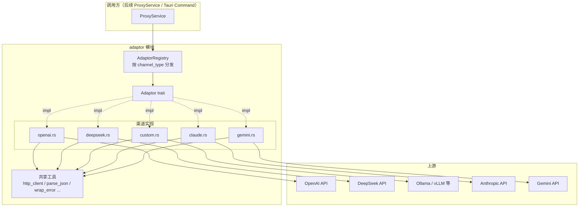
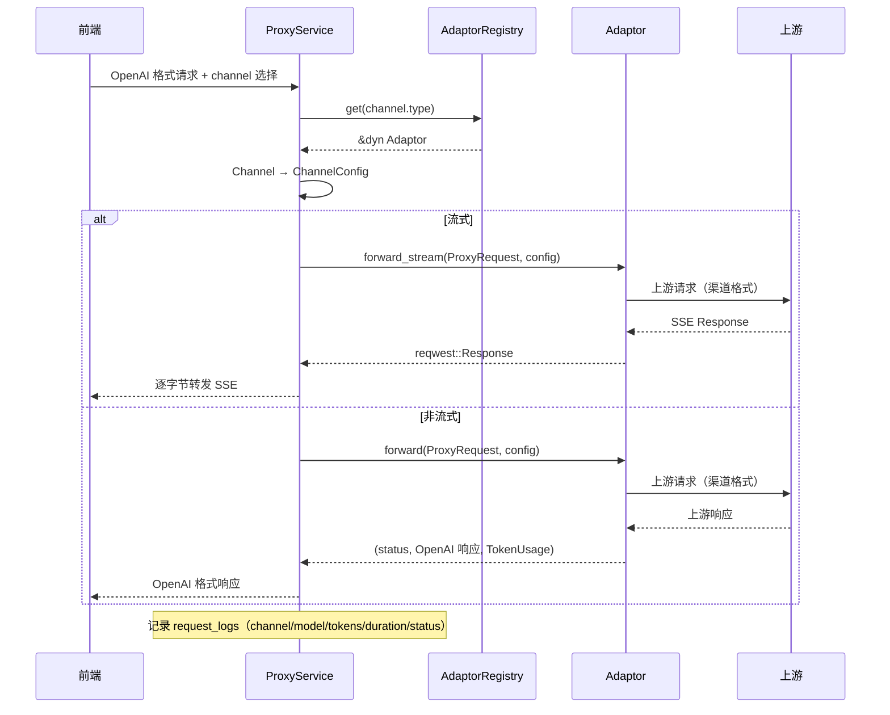

# 适配层（Adaptor）实现设计

本文档描述 AIO Gateway 后端适配层的实现设计：外部统一以 **OpenAI 格式**收发请求，内部将请求/响应转换为各家 LLM 渠道的私有格式。

## 1. 设计目标

- **统一对外契约**：网关对客户端只暴露 OpenAI 兼容 API（`/chat/completions`），客户端无感知渠道差异
- **可扩展**：新增渠道只需实现 `Adaptor` trait 并注册，网关主流程零改动
- **职责单一**：格式转换、鉴权头、URL 构造在各自 adaptor 内完成；HTTP 发送工具、错误包装等共享逻辑收敛在模块级

## 2. 模块架构



**文件清单：**

| 文件 | 职责 |
|------|------|
| `src/adaptor/mod.rs` | `Adaptor` trait、`AdaptorRegistry`、共享工具函数 |
| `src/adaptor/openai.rs` | OpenAI 渠道 + OpenAI 兼容通用实现（DeepSeek/Custom 复用） |
| `src/adaptor/deepseek.rs` | DeepSeek 渠道（复用 openai 通用实现） |
| `src/adaptor/custom.rs` | 自定义 OpenAI 兼容渠道（Ollama/vLLM 等） |
| `src/adaptor/claude.rs` | OpenAI ↔ Claude 格式转换 |
| `src/adaptor/gemini.rs` | OpenAI ↔ Gemini 格式转换 |

## 3. 核心抽象

### 3.1 Adaptor trait

定义于 `src/adaptor/mod.rs`，使用 `async_trait`（项目为 Rust 2021 edition，原生 async fn in trait 不可用）：

```rust
#[async_trait]
pub trait Adaptor: Send + Sync {
    /// 渠道类型标识
    fn channel_type(&self) -> &'static str;
    /// 默认支持的模型列表
    fn default_models(&self) -> Vec<&'static str>;
    /// 默认 API 地址
    fn default_base_url(&self) -> &str;

    /// 测试渠道连通性
    async fn test(&self, config: &ChannelConfig) -> Result<TestResult, anyhow::Error>;

    /// 非流式转发：返回 (状态码, OpenAI 格式响应体, Token用量)
    async fn forward(
        &self,
        request: &ProxyRequest,
        config: &ChannelConfig,
    ) -> Result<(u16, serde_json::Value, Option<TokenUsage>), anyhow::Error>;

    /// 流式转发：直接返回 reqwest::Response，由调用方逐字节转发 SSE
    async fn forward_stream(
        &self,
        request: &ProxyRequest,
        config: &ChannelConfig,
    ) -> Result<reqwest::Response, anyhow::Error>;
}
```

**设计决策：**

| 决策点 | 结论 | 理由 |
|--------|------|------|
| HTTP 发送是否入 trait | 是（`forward`/`forward_stream` 内部完成） | 渠道间 URL 路径、鉴权头差异大，统一发送层反而引入复杂配置 |
| 流式如何透传 | 直接返回 `reqwest::Response`，调用方逐字节转发 | SSE 逐 chunk 转换需跨格式解析流，首版先透传；调用方负责转发 header（`Content-Type: text/event-stream`） |
| 错误类型 | `anyhow::Error` | trait 面向调用方，避免自定义错误枚举扩散；HTTP 错误已包装进响应体不抛 Err |
| `test` 的失败语义 | 所有可预期失败（HTTP 非 2xx、网络错误、URL 无效）都返回 `Ok(TestResult { success: false })`，不抛 Err | 前端只需处理一种返回形态 |

### 3.2 数据结构

| 结构体 | 字段 | 说明 |
|--------|------|------|
| `ChannelConfig` | `base_url` / `api_key` / `models: Vec<String>` / `model_mapping: Value` / `extra: Value` | 由数据库 `channels` 表行转换而来，与 [database-schema.md](./database-schema.md) 的 JSON 字段对应 |
| `ProxyRequest` | `model` / `body: Value`（OpenAI 格式）/ `stream` | 统一请求抽象，`body` 即前端传入的 OpenAI 请求体 |
| `TestResult` | `success` / `message` / `latency_ms` | 连通性测试结果 |
| `TokenUsage` | `prompt_tokens` / `completion_tokens` / `total_tokens` | 统一各家计费格式，用于写入 `request_logs` |

### 3.3 AdaptorRegistry

```rust
pub struct AdaptorRegistry { /* HashMap<&'static str, Box<dyn Adaptor>> */ }

impl AdaptorRegistry {
    pub fn new() -> Self;                       // 注册全部内置渠道
    pub fn get(&self, channel_type: &str) -> Option<&dyn Adaptor>;  // 按类型分发
    pub fn all(&self) -> Vec<&dyn Adaptor>;     // 供前端展示各渠道默认配置
}
```

- `new()` 内注册：openai / claude / gemini / deepseek / custom 五个适配器，key 与 `channels.type` 字段一致
- `all()` 供创建渠道页面使用：选择渠道类型后，可自动填充默认 `base_url` 与 `models`（`default_base_url` / `default_models`）

## 4. 渠道实现矩阵

| 渠道 | `channel_type` | 默认模型 | 默认 base_url | 上游端点 | 格式策略 |
|------|----------------|----------|---------------|----------|----------|
| openai | `openai` | gpt-4o, gpt-4o-mini, gpt-4-turbo, gpt-3.5-turbo | `https://api.openai.com/v1` | `POST /chat/completions` | 透传 |
| deepseek | `deepseek` | deepseek-v4-flash, deepseek-v4-pro | `https://api.deepseek.com/v1` | `POST /chat/completions` | 复用 OpenAI 兼容实现 |
| custom | `custom` | （空，用户自填） | （空，用户自填） | `POST /chat/completions` | 复用 OpenAI 兼容实现 |
| claude | `claude` | claude-sonnet-4-5, claude-opus-4-1, claude-3-5-sonnet-latest, claude-3-5-haiku-latest | `https://api.anthropic.com/v1` | `POST /messages` | 格式转换（§5.2） |
| gemini | `gemini` | gemini-2.5-pro, gemini-2.5-flash, gemini-2.5-flash-lite, gemini-2.0-flash | `https://generativelanguage.googleapis.com/v1beta` | `POST /models/{model}:generateContent` | 格式转换（§5.3） |

**鉴权头：**

| 渠道 | 鉴权方式 |
|------|----------|
| OpenAI 兼容 | `Authorization: Bearer {api_key}` |
| Claude | `x-api-key: {api_key}` + `anthropic-version: 2023-06-01` |
| Gemini | URL query 参数 `?key={api_key}`（流式追加 `&alt=sse`） |

## 5. 格式转换规则

所有转换输入均为 OpenAI 格式（`messages`、`model`、`temperature`、`max_tokens`、`stop`、`stream`），输出为各渠道私有格式；响应转换反向执行。

### 5.1 OpenAI 兼容渠道（openai / deepseek / custom）

请求体直接透传，仅做两处处理：

1. **`stream` 字段强制覆盖**：非流式转发置 `false`，流式转发置 `true`（与调用路径一致，防止上游歧义）
2. **模型映射**：`config.model_mapping` 为 `{外部模型名: 渠道内部模型名}`，存在映射则替换 `body.model`

响应直接透传，仅提取 `usage` 生成 `TokenUsage`；非 2xx 时按 §6 包装错误。

### 5.2 Claude（`openai_to_claude` / `claude_to_openai`）

**请求转换（`POST /messages`）：**

| OpenAI 字段 | Claude 字段 | 处理规则 |
|-------------|-------------|----------|
| `messages[role=system].content` | 顶层 `system` | 拆出并拼接为字符串 |
| `messages[role=user/assistant].content` | `messages[].content` | role 映射：assistant→assistant，其余→user |
| `messages[].content`（数组） | 同 | `text` 块透传；`image_url` 块转为 `{type: image, source: {type: url, url}}`；其余忽略 |
| `max_tokens` | `max_tokens` | **必填字段**，缺失时默认 4096 |
| `temperature` / `top_p` / `stop` | 同名 | 透传 |
| `stream` | `stream` | 透传 |

**响应转换（Claude → OpenAI）：**

| Claude 字段 | OpenAI 字段 | 处理规则 |
|-------------|-------------|----------|
| `content[].text` | `choices[0].message.content` | 拼接全部 text 块 |
| `stop_reason` | `choices[0].finish_reason` | `max_tokens`→`length`，`tool_use`→`tool_calls`，其余→`stop` |
| `usage.input_tokens` / `output_tokens` | `usage.prompt_tokens` / `completion_tokens` / `total_tokens` | total = input + output |
| `id` / `model` | 同名 | 透传 |
| - | `object: "chat.completion"` / `created` | 固定值 / 当前时间戳 |

### 5.3 Gemini（`openai_to_gemini` / `gemini_to_openai`）

**请求转换（`POST /models/{model}:generateContent?key=...`）：**

| OpenAI 字段 | Gemini 字段 | 处理规则 |
|-------------|-------------|----------|
| `model` | URL 路径 `/models/{model}:generateContent` | 模型名不进请求体 |
| `messages[role=system].content` | `systemInstruction.parts[].text` | 拆出 |
| `messages[role=user/assistant].content` | `contents[].parts[]` | role 映射：assistant→model，其余→user；`text` 块透传；`image_url` 忽略（需 base64，暂不支持） |
| `temperature` | `generationConfig.temperature` | 透传 |
| `top_p` | `generationConfig.topP` | 透传 |
| `max_tokens` | `generationConfig.maxOutputTokens` | 透传 |
| `stop` | `generationConfig.stopSequences` | 透传 |

**响应转换（Gemini → OpenAI）：**

| Gemini 字段 | OpenAI 字段 | 处理规则 |
|-------------|-------------|----------|
| `candidates[0].content.parts[].text` | `choices[0].message.content` | 拼接全部 text |
| `candidates[0].finishReason` | `choices[0].finish_reason` | `MAX_TOKENS`→`length`，`SAFETY`/`RECITATION`/`BLOCKLIST`→`content_filter`，其余→`stop` |
| `usageMetadata.promptTokenCount` / `candidatesTokenCount` / `totalTokenCount` | `usage.*` | 直接映射 |
| - | `id` | 生成 `chatcmpl-{uuid}`（上游无 id） |
| - | `model` | 置 null（上游响应不返回 model） |

## 6. 错误处理与超时策略

### 错误处理

- **上游非 2xx**：不抛 Err，返回 `(status, wrap_error(...), None)`。`wrap_error` 将上游错误体统一包装为 OpenAI error 格式：

```json
{
  "error": {
    "message": "上游错误信息（优先取 error.message，否则取原始 body）",
    "type": "upstream_error",
    "code": 401
  }
}
```

- **网络错误 / URL 无效**：`forward`/`forward_stream` 通过 `?` 传播 `anyhow::Error`，由调用方决定策略（重试 / 切换渠道 / 返回 502）
- **非 JSON 响应体**：`parse_json` 兜底为 `{"raw": "原始文本"}`，避免反序列化 panic

### HTTP 客户端（共享单例，`OnceLock`）

| 客户端 | 超时策略 | 用途 |
|--------|----------|------|
| `http_client()` | 总超时 60s | 非流式转发、连通性测试 |
| `stream_http_client()` | 仅连接超时 10s，无总超时 | 流式转发——总超时会切断长连接 SSE |

## 7. 共享工具函数（`adaptor/mod.rs`）

| 函数 | 签名 | 说明 |
|------|------|------|
| `build_url` | `(config, path) -> Result<Url>` | base_url + 路径拼接，兼容尾斜杠 |
| `http_client` / `stream_http_client` | `-> Client` | 两个超时策略不同的共享客户端 |
| `parse_json` | `async (Response) -> (u16, Value)` | 读响应体并解析，非 JSON 兜底 |
| `wrap_error` | `(status, body) -> Value` | 包装 OpenAI 格式错误响应 |
| `apply_model_mapping` | `(&mut body, config)` | 外部模型名 → 渠道内部模型名 |
| `extract_usage` | `(body) -> Option<TokenUsage>` | 从 OpenAI 兼容响应提取用量 |
| `collect_text` | `(msg, &mut String)` | 提取消息文本（system 消息 / text 块） |
| `truncate` | `(text, max) -> String` | 按字符截断（UTF-8 安全），用于错误消息展示 |

## 8. 调用方约定（下一步：ProxyService）

adaptor 层当前为独立模块（未被调用），后续 `ProxyService` 调用流程：



要点：

- `ProxyService` 持有 `AdaptorRegistry` 单例（Tauri `app.manage` 托管）
- 非流式：把 `forward` 返回的 `TokenUsage` 与耗时写入 `request_logs`
- 流式：`forward_stream` 成功后转发响应，需透传 `Content-Type: text/event-stream`；日志在流结束后补记（token 取自上游 `usage` 或省略）
- 失败重试、渠道负载均衡（按 `priority`/`weight` 选择渠道）属于 ProxyService 职责，adaptor 层不感知

## 9. 测试计划

| 层级 | 用例 | 方式 |
|------|------|------|
| 单元 | `openai_to_claude`：system 拆出、image_url 转换、max_tokens 默认值 | 构造 OpenAI 请求 JSON 断言 Claude 输出 |
| 单元 | `claude_to_openai` / `gemini_to_openai`：字段映射、finish_reason 映射、usage 汇总 | 构造上游响应 JSON 断言 OpenAI 输出 |
| 单元 | `apply_model_mapping`：命中/未命中映射 | 多组 model_mapping 输入 |
| 集成 | 各渠道 `test()` 连通性（可用 mock server 模拟 2xx/4xx/网络错误） | `wiremock` 或本地 mock |
| 集成 | `forward` 非 2xx 时返回 `wrap_error` 格式 | mock server 返回 401 |
| 端到端 | 真实渠道（openai/deepseek/claude/gemini）连通性与一次对话 | 手工 + 测试 API Key |

## 10. 已知限制（首版）

- **流式响应未做格式转换**：Claude 的 SSE（`event: message_start` 等）与 Gemini 的 SSE 直接透传，前端需兼容各家流式格式；后续可加 `convert_stream_chunk` 逐块转换
- **Gemini 图片不支持**：`image_url` 需 base64 的 `inlineData`，首版忽略
- **Claude tool 调用**：响应中 `tool_use` 块不转换（finish_reason 标记为 `tool_calls`，内容不含工具调用数据），后续按需扩展
- **默认模型列表为静态快照**：模型名会随上游演进过期，可由前端从 `test()` 返回结果或用户手动维护
