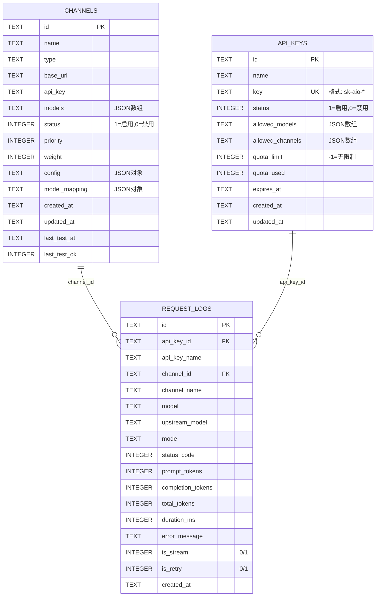

# 数据库表结构

本文档描述 AIO Gateway 后端的数据库表结构。

## 表关系图

## 表详细说明

### 1. channels（渠道表）

存储上游 LLM API 渠道配置信息。

| 字段 | 类型 | 约束 | 说明 |
|------|------|------|------|
| id | TEXT | PRIMARY KEY | 渠道唯一标识 |
| name | TEXT | NOT NULL | 渠道名称 |
| type | TEXT | NOT NULL | 渠道类型（openai/deepseek/claude/gemini） |
| base_url | TEXT | NOT NULL | API 基础 URL |
| api_key | TEXT | NOT NULL | API 密钥 |
| models | TEXT | NOT NULL DEFAULT '[]' | 支持的模型列表（JSON 数组） |
| status | INTEGER | NOT NULL DEFAULT 1 | 状态：1=启用，0=禁用 |
| priority | INTEGER | NOT NULL DEFAULT 0 | 优先级（数值越大优先级越高） |
| weight | INTEGER | NOT NULL DEFAULT 1 | 权重（负载均衡用） |
| config | TEXT | NOT NULL DEFAULT '{}' | 额外配置（JSON 对象） |
| model_mapping | TEXT | NOT NULL DEFAULT '{}' | 模型映射规则（JSON 对象） |
| created_at | TEXT | NOT NULL | 创建时间（ISO 8601） |
| updated_at | TEXT | NOT NULL | 更新时间（ISO 8601） |
| last_test_at | TEXT | - | 最后测试时间 |
| last_test_ok | INTEGER | - | 最后测试结果：1=成功，0=失败 |

**索引：** 无

---

### 2. api_keys（API 密钥表）

管理对外提供的 API 访问密钥。

| 字段 | 类型 | 约束 | 说明 |
|------|------|------|------|
| id | TEXT | PRIMARY KEY | 密钥唯一标识 |
| name | TEXT | NOT NULL | 密钥名称/描述 |
| key | TEXT | NOT NULL UNIQUE | API 密钥值（格式：sk-aio-*） |
| status | INTEGER | NOT NULL DEFAULT 1 | 状态：1=active，0=disabled |
| allowed_models | TEXT | NOT NULL DEFAULT '[]' | 允许使用的模型列表（JSON 数组） |
| allowed_channels | TEXT | NOT NULL DEFAULT '[]' | 允许使用的渠道列表（JSON 数组） |
| quota_limit | INTEGER | NOT NULL DEFAULT -1 | 配额限制（-1=无限制） |
| quota_used | INTEGER | NOT NULL DEFAULT 0 | 已使用配额 |
| expires_at | TEXT | - | 过期时间（ISO 8601，NULL=永不过期） |
| created_at | TEXT | NOT NULL | 创建时间（ISO 8601） |
| updated_at | TEXT | NOT NULL | 更新时间（ISO 8601） |

**索引：** 无

---

### 3. request_logs（请求日志表）

记录所有 API 请求的详细信息。

| 字段 | 类型 | 约束 | 说明 |
|------|------|------|------|
| id | TEXT | PRIMARY KEY | 日志唯一标识 |
| api_key_id | TEXT | - | 关联的 API 密钥 ID（逻辑外键） |
| api_key_name | TEXT | - | API 密钥名称（冗余字段） |
| channel_id | TEXT | - | 关联的渠道 ID（逻辑外键） |
| channel_name | TEXT | - | 渠道名称（冗余字段） |
| model | TEXT | NOT NULL | 请求的模型名称 |
| upstream_model | TEXT | - | 上游实际使用的模型名称 |
| mode | TEXT | NOT NULL | 请求模式 |
| status_code | INTEGER | NOT NULL | HTTP 状态码 |
| prompt_tokens | INTEGER | NOT NULL DEFAULT 0 | 输入 token 数 |
| completion_tokens | INTEGER | NOT NULL DEFAULT 0 | 输出 token 数 |
| total_tokens | INTEGER | NOT NULL DEFAULT 0 | 总 token 数 |
| duration_ms | INTEGER | NOT NULL DEFAULT 0 | 请求耗时（毫秒） |
| error_message | TEXT | - | 错误信息（失败时） |
| is_stream | INTEGER | NOT NULL DEFAULT 0 | 是否流式请求：0/1 |
| is_retry | INTEGER | NOT NULL DEFAULT 0 | 是否重试请求：0/1 |
| created_at | TEXT | NOT NULL | 创建时间（ISO 8601） |

**索引：**
- `idx_logs_created` - created_at（按时间查询）
- `idx_logs_channel` - channel_id（按渠道查询）
- `idx_logs_api_key` - api_key_id（按 API 密钥查询）
- `idx_logs_model` - model（按模型查询）

---

## 设计说明

### JSON 字段处理

以下字段使用 JSON 格式存储，在 Rust 中需要序列化/反序列化：
- `channels.models` - `["gpt-4", "gpt-3.5-turbo"]`
- `channels.config` - `{"temperature": 0.7, "max_tokens": 4096}`
- `channels.model_mapping` - `{"gpt-4": "gpt-4-turbo"}`
- `api_keys.allowed_models` - `["gpt-4", "claude-3"]`
- `api_keys.allowed_channels` - `["channel-1", "channel-2"]`

### 时间字段

所有时间字段使用 ISO 8601 格式的 TEXT 存储，例如：`2026-08-04T22:00:00Z`

### 外键关系

虽然表结构中未定义物理外键约束，但存在以下逻辑关系：
- `request_logs.api_key_id` → `api_keys.id`
- `request_logs.channel_id` → `channels.id`

使用逻辑外键而非物理外键的原因：
1. 更好的写入性能
2. 允许日志记录保留历史数据（即使关联记录被删除）
3. 冗余字段（api_key_name, channel_name）避免频繁 JOIN 查询

### 状态字段约定

- `channels.status`: 1=启用, 0=禁用
- `api_keys.status`: 1=active, 0=disabled
- `request_logs.is_stream`: 0=否, 1=是
- `request_logs.is_retry`: 0=否, 1=是
- `channels.last_test_ok`: 1=成功, 0=失败, NULL=未测试
