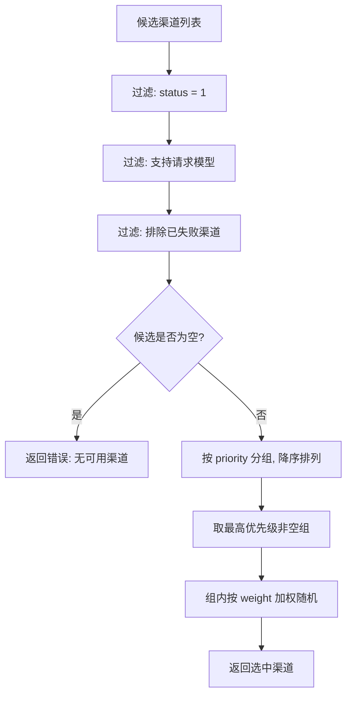

# 负载均衡 Dispatcher 技术设计

本文档描述 AIO Gateway 渠道负载均衡分发器（Dispatcher）的技术设计，采用 **「优先级分组 + 组内权重随机」** 混合策略，用于网关转发请求时从多个启用渠道中选择目标渠道。

## 1. 背景与目标

- 同一模型可能配置在多个渠道（如 OpenAI 主渠道 + DeepSeek 备渠道），请求到达时需要决定转发给谁
- `channels` 表已具备两个关键字段（见 [database-schema.md](./database-schema.md)）：
  - `priority`：优先级，**数值越大优先级越高**（默认 0）
  - `weight`：权重，**数值越大被选中的概率越大**（默认 1）
- 目标：提供**纯内存、无状态、可测试**的选择器组件，供 ProxyService 在每次转发前调用；选择过程不发起任何网络请求

## 2. 策略定义

### 2.1 优先级分组

1. 将候选渠道按 `priority` 值分组（同一 priority 归为一组）
2. 按 priority **降序**排列组（数值大的组优先）
3. 只从**最高优先级且非空**的组中选择渠道

语义：priority 表达「主备」关系——高优先级渠道是首选，只有该组全部不可用时才考虑低优先级组。

### 2.2 组内权重随机

在选定的优先级组内，按 `weight` 做**加权随机**：

- 渠道被选中的概率 ∝ weight，与 weight 的具体数值无关（只与相对大小有关）
- `weight = 3` 的渠道被选中的概率是 `weight = 1` 渠道的 3 倍
- 同组渠道 `weight` 相同 → 等概率随机（天然实现轮询效果，无需额外状态）

### 2.3 整体决策流程



**降级规则**：选择阶段**只取最高优先级组**，不主动跨组降级；跨组降级由调用方（ProxyService）在**重试**时驱动——同组渠道全部失败后，排除失败渠道重新选择，此时最高优先级组为空，自然落入次高组。这样把「选择」与「重试」解耦，Dispatcher 保持无状态。

## 3. 模块设计与接口

### 3.1 模块位置

新增 `src-tauri/src/services/dispatcher.rs`（与 `channel_service.rs` 同级），在 `services/mod.rs` 中导出。

### 3.2 核心结构

```rust
/// 分发错误
#[derive(Debug, Error)]
pub enum DispatchError {
    /// 无任何启用且支持该模型的渠道
    #[error("无可用渠道: {0}")]
    NoAvailable(String),
}

/// 渠道分发器：纯内存、无状态
pub struct Dispatcher;

impl Dispatcher {
    /// 从候选渠道中选择一个目标渠道
    ///
    /// - `candidates`：候选渠道列表（通常来自 ChannelRepo::find_enabled）
    /// - `model`：请求的模型名（外部名，与 channels.models 中存的一致）
    /// - `exclude`：本次请求已失败的渠道 id 列表（重试时排除，首轮为空）
    pub fn select<'a>(
        candidates: &'a [Channel],
        model: &str,
        exclude: &[&str],
    ) -> Result<&'a Channel, DispatchError>;
}
```

**设计决策：**

| 决策点 | 结论 | 理由 |
|--------|------|------|
| 有状态还是无状态 | 无状态（每次 select 传入候选列表） | 渠道列表随时可能被 CRUD 修改，Dispatcher 不缓存，数据永远新鲜；天然可测试 |
| 选择是否发起网络请求 | 否 | 连通性探测属于健康检查范畴，不在本次范围内；首版假设启用渠道即可用 |
| 模型过滤入参 | 按外部模型名过滤 | 请求到达网关时用的是外部模型名，`models` 字段存的也是外部名；`model_mapping` 是转发时才应用 |
| `exclude` 语义 | 按渠道 id 排除 | 重试时避免再次选到刚失败的渠道 |

### 3.3 候选渠道来源

```rust
// ProxyService 中的调用示例
let enabled = ChannelRepo::find_enabled(pool).await?;   // 已按 priority DESC 排序
let channel = Dispatcher::select(&enabled, &model, &failed_ids)?;
```

复用现有 `ChannelRepo::find_enabled`（`status = 1 ORDER BY priority DESC, created_at DESC`），Dispatcher 内部再次分组以保证语义自洽（不依赖调用方的排序假设）。

## 4. 算法细节

### 4.1 候选筛选

```rust
let candidates: Vec<&Channel> = candidates
    .iter()
    .filter(|c| c.status == 1)                                  // 双保险过滤
    .filter(|c| !exclude.contains(&c.id.as_str()))              // 排除已失败
    .filter(|c| channel_supports_model(c, model))               // 模型匹配
    .collect();
```

**模型匹配规则**：解析 `channels.models`（JSON 数组字符串），包含 `model` 即视为支持；`models` 为空数组时视为**支持所有模型**（通配）。

### 4.2 优先级分组

```rust
// 按 priority 分组（HashMap<i32, Vec<&Channel>>），再取 max key 的组
// 若最高组非空则使用之；候选为空则返回 NoAvailable
```

### 4.3 组内加权随机（累计权重法）

```rust
fn weighted_random<'a>(group: &[&'a Channel]) -> &'a Channel {
    // 1. weight <= 0 的渠道跳过（防御：前端约束 min=1，但数据可能被直改）
    // 2. 计算总权重 total
    // 3. 若 total == 0（全部 weight<=0）→ 退化为均匀随机（rand 0..len）
    // 4. r = rand(total)；遍历累加 weight，r < 累计值即选中
}
```

示例（同组 3 个渠道）：

| 渠道 | weight | 命中区间 | 概率 |
|------|--------|----------|------|
| A | 3 | [0, 3) | 50% |
| B | 2 | [3, 5) | 33.3% |
| C | 1 | [5, 6) | 16.7% |

### 4.4 重试与降级（调用方驱动）

```rust
// ProxyService 伪代码：最多尝试 N 次
let mut failed: Vec<String> = Vec::new();
for _ in 0..max_retries {
    let channel = Dispatcher::select(&enabled, &model, &failed)?;
    match forward(channel, request).await {
        Ok(resp) => return Ok(resp),
        Err(e) => {
            failed.push(channel.id.clone());   // 失败渠道进入排除列表
            // 同组渠道耗尽后，select 自动落入次高优先级组 → 实现降级
        }
    }
}
```

重试次数与间隔由设置中心的 RetryPolicy 控制（`strategy / maxRetries / baseDelay / maxDelay`），Dispatcher 不感知。

## 5. 边界情况

| 场景 | 行为 |
|------|------|
| 无任何启用渠道 | 返回 `NoAvailable("无启用渠道")` |
| 启用但无渠道支持请求模型 | 返回 `NoAvailable("无支持模型 {model} 的渠道")` |
| 最高优先级组全部被 exclude | 自动落入次高优先级组 |
| 组内某渠道 `weight <= 0` | 该渠道不参与随机（视为不可用） |
| 组内全部 `weight <= 0` | 退化为均匀随机 |
| `models` 为空数组 | 通配，支持所有模型 |
| `models` 为非法 JSON | 视为空数组（通配），解析失败不 panic |
| 单个渠道（无论 priority/weight） | 直接命中 |

## 6. 依赖变更

新增随机数依赖：

```toml
rand = "0.9"
```

仅 Dispatcher 内部使用；如后续需要可复用的随机工具再抽取。

## 7. 测试计划

| 层级 | 用例 |
|------|------|
| 单元 | 同优先级、不同 weight 的分布符合概率（大量采样后比例≈权重比，如 3:2:1） |
| 单元 | 不同 priority：最高优先级组非空时，低优先级组永远不被选中 |
| 单元 | 最高组全部排除后，选中次高组 |
| 单元 | `weight <= 0` 不参与；全 0 时均匀随机 |
| 单元 | 模型过滤：匹配 / 不匹配 / models 为空（通配）/ 非法 JSON |
| 单元 | 无候选、全被排除 → `NoAvailable` |
| 集成 | `find_enabled` + select 全链路（含排序不依赖） |

## 8. 后续扩展（本期不做）

- **健康检查与熔断**：定时探测渠道连通性（复用 `Adaptor::test`），失败渠道自动摘除并冷却
- **会话保持（sticky）**：同一 `user_id` / API Key 尽量命中同一渠道（KVCache 命中率）
- **动态权重**：根据延迟/错误率动态调整 weight
- **并发保护**：渠道级限流（对接数据库 `config` 字段中的并发上限）
