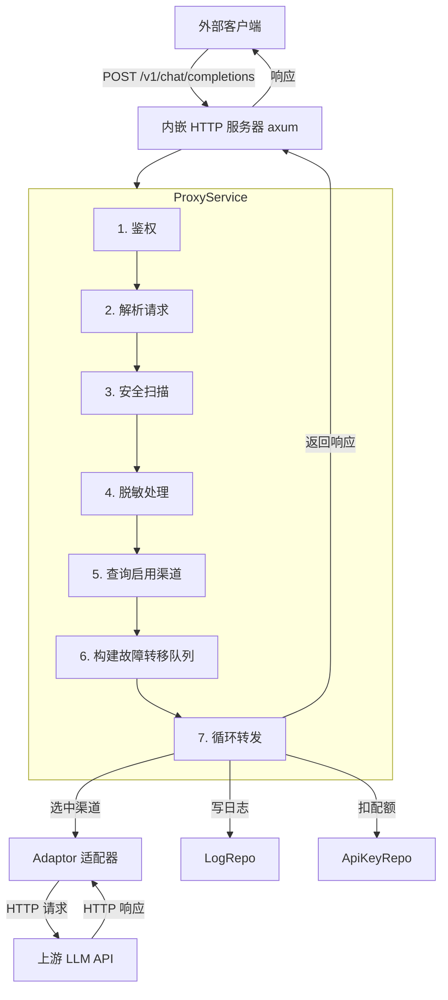
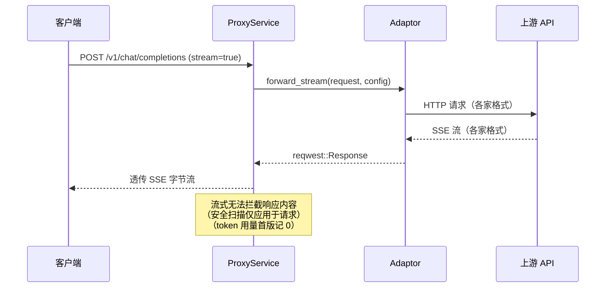

# ProxyService 技术设计

本文档描述 AIO Gateway 核心代理服务（ProxyService）的技术设计。代理服务是网关的**核心转发引擎**：接收外部 OpenAI 格式请求，经过鉴权、安全扫描、脱敏、调度、转发、日志记录后，将响应返回给调用方。

## 1. 背景与目标

当前项目已具备：

| 组件 | 状态 | 说明 |
|------|------|------|
| Adaptor trait + 5 个实现 | ✅ | openai / deepseek / claude / gemini / custom |
| Dispatcher | ✅ | 优先级分组 + 组内权重随机 + to_channel_config |
| AdaptorRegistry | ✅ | State 托管，按渠道类型获取适配器 |
| ChannelRepo | ✅ | find_enabled 查询启用渠道 |
| ApiKeyRepo | ✅ | CRUD + find_all，但**缺少鉴权查询** |
| LogRepo | ✅ | search（分页查询），但**缺少 create（写入日志）** |
| HTTP 服务器 | ❌ | 无，需要内嵌 HTTP 服务器暴露代理端点 |

**目标**：实现完整的代理转发链路，使外部应用可以通过 `http://localhost:{port}/v1/chat/completions` 以 OpenAI 兼容格式调用网关。

## 2. 架构概览



## 3. 依赖变更

```toml
# 内嵌 HTTP 服务器（轻量、tokio 原生）
axum = { version = "0.8", features = ["json"] }
tokio = { version = "1", features = ["full"] }
tower = "0.5"
tower-http = { version = "0.6", features = ["cors"] }
```

**选型理由**：

| 候选 | 结论 | 理由 |
|------|------|------|
| axum | ✅ 选用 | tokio 官方维护，与 Tauri 的 tokio runtime 天然兼容；轻量、类型安全 |
| actix-web | ❌ | 自带 runtime，与 Tauri tokio 冲突 |
| warp | ❌ | 已停止活跃维护 |

## 4. 核心数据结构

### 4.1 代理请求上下文

```rust
/// 代理请求的完整上下文——贯穿整个处理流程
pub struct ProxyContext {
    /// 请求 ID（UUID，用于日志关联）
    pub request_id: String,
    /// 请求开始时间（用于计算 duration_ms）
    pub started_at: std::time::Instant,
    /// 认证通过的 API Key
    pub api_key: ApiKey,
    /// 请求模型（外部名，body.model）
    pub model: String,
    /// 请求体（OpenAI 格式 JSON）
    pub body: serde_json::Value,
    /// 是否流式请求
    pub is_stream: bool,
    /// 已失败的渠道 id 列表（重试时排除）
    pub failed_channel_ids: Vec<String>,
}
```

### 4.2 代理响应

```rust
/// 代理转发结果
pub enum ProxyResult {
    /// 非流式：状态码 + OpenAI 格式响应体 + Token 用量
    Standard {
        status: u16,
        body: serde_json::Value,
        usage: Option<TokenUsage>,
    },
    /// 流式：reqwest::Response（SSE 透传）
    Stream(reqwest::Response),
}
```

### 4.3 代理错误

```rust
#[derive(Debug, Error)]
pub enum ProxyError {
    #[error("未提供 API Key")]
    MissingApiKey,

    #[error("API Key 无效或已禁用")]
    InvalidApiKey,

    #[error("API Key 已过期")]
    ExpiredApiKey,

    #[error("配额已用尽")]
    QuotaExhausted,

    #[error("请求体格式错误: {0}")]
    BadRequest(String),

    #[error("请求被安全策略拦截: {0}")]
    Blocked(String),

    #[error("无可用渠道: {0}")]
    NoAvailableChannel(String),

    #[error("所有渠道均失败")]
    AllChannelsFailed,

    #[error("上游请求失败: {0}")]
    UpstreamError(String),
}
```

每种错误对应不同的 HTTP 状态码：

| 错误类型 | HTTP 状态码 | 响应格式 |
|----------|-------------|----------|
| MissingApiKey / InvalidApiKey / ExpiredApiKey | 401 | OpenAI error 格式 |
| QuotaExhausted | 429 | OpenAI error 格式 |
| BadRequest | 400 | OpenAI error 格式 |
| Blocked | 451 | OpenAI error 格式 |
| NoAvailableChannel | 503 | OpenAI error 格式 |
| AllChannelsFailed | 502 | OpenAI error 格式 |
| UpstreamError | 502 | OpenAI error 格式 |

## 5. 处理流程详解

### 5.1 步骤 1：鉴权

从请求 `Authorization: Bearer sk-aio-xxx` 提取 key，查询 `api_keys` 表验证：

```rust
async fn authenticate(pool: &SqlitePool, auth_header: Option<&str>) -> Result<ApiKey, ProxyError> {
    // 1. 提取 Bearer token
    // 2. 查询 api_keys WHERE key = ? AND status = 1
    // 3. 检查过期时间（expires_at 不为空且 < 当前时间 → ExpiredApiKey）
    // 4. 检查配额（quota_limit != -1 且 quota_used >= quota_limit → QuotaExhausted）
    // 5. 返回 ApiKey
}
```

**需要新增**：`ApiKeyRepo::find_by_key(pool, key)` 方法。

### 5.2 步骤 2：解析请求

```rust
// 1. 解析 body 为 JSON
// 2. 提取 body.model（必须存在）
// 3. 判断 is_stream = body["stream"] == true
// 4. 构造 ProxyContext
```

### 5.3 步骤 3：安全扫描

设计为**可插拔 trait**，首版提供默认 pass-through 实现：

```rust
#[async_trait]
pub trait RequestScanner: Send + Sync {
    /// 扫描请求体，返回 Some(原因) 表示拦截，None 表示放行
    async fn scan_request(&self, body: &serde_json::Value) -> Option<String>;

    /// 扫描响应体，返回 Some(原因) 表示拦截，None 表示放行
    async fn scan_response(&self, body: &serde_json::Value) -> Option<String>;
}

/// 默认实现：不拦截任何请求
pub struct PassThroughScanner;

#[async_trait]
impl RequestScanner for PassThroughScanner {
    async fn scan_request(&self, _body: &serde_json::Value) -> Option<String> {
        None
    }
    async fn scan_response(&self, _body: &serde_json::Value) -> Option<String> {
        None
    }
}
```

**拦截时**：记录日志 + 返回 451（Unavailable For Legal Reasons）。

**后续扩展**：可接入关键词正则、敏感词库、外部审核 API 等。

### 5.4 步骤 4：脱敏处理

同样可插拔，首版 pass-through：

```rust
#[async_trait]
pub trait Desensitizer: Send + Sync {
    /// 对请求体进行脱敏处理（如替换手机号、身份证等）
    async fn desensitize(&self, body: &mut serde_json::Value);
}

pub struct NoopDesensitizer;

#[async_trait]
impl Desensitizer for NoopDesensitizer {
    async fn desensitize(&self, _body: &mut serde_json::Value) {}
}
```

**后续扩展**：正则替换手机号/身份证/邮箱等 PII 信息。

### 5.5 步骤 5-6：查询渠道 + 构建故障转移队列

**Dispatcher 需要新增方法**：

```rust
impl Dispatcher {
    /// 构建故障转移队列：按优先级分组，组内按权重排序，返回有序的渠道列表
    ///
    /// 与 select() 的区别：
    /// - select()：只返回一个（加权随机）
    /// - build_queue()：返回完整的有序列表，供 ProxyService 依次尝试
    ///
    /// 队列构建规则：
    /// 1. 过滤：status=1 + 支持 model + 未在 exclude 中
    /// 2. 按 priority 降序排列组
    /// 3. 每组内按 weight 降序排列（权重大的排前面）
    /// 4. 同 weight 的渠道随机排列（避免固定顺序）
    pub fn build_queue<'a>(
        candidates: &'a [Channel],
        model: &str,
        exclude: &[&str],
    ) -> Vec<&'a Channel>;
}
```

**队列示例**：

```
候选渠道：
  A: priority=10, weight=3
  B: priority=10, weight=2
  C: priority=10, weight=1
  D: priority=5,  weight=1
  E: priority=5,  weight=1

build_queue 结果：
  [A, B, C, D, E] 或 [A, C, B, D, E] 或 [B, A, C, E, D] ...
  （同优先级组内按权重降序，同权重随机；跨组按优先级降序排列）
```

### 5.6 步骤 7：循环转发

```rust
pub async fn handle(ctx: &mut ProxyContext, pool: &SqlitePool, registry: &AdaptorRegistry) -> Result<ProxyResult, ProxyError> {
    let enabled = ChannelRepo::find_enabled(pool).await?;
    let queue = Dispatcher::build_queue(&enabled, &ctx.model, &ctx.failed_ids());

    if queue.is_empty() {
        return Err(ProxyError::NoAvailableChannel(ctx.model.clone()));
    }

    let max_attempts = settings.max_retries.min(queue.len());

    for (attempt, channel) in queue.into_iter().take(max_attempts).enumerate() {
        let config = Dispatcher::to_channel_config(channel);
        let adaptor = registry.get(&channel.r#type)
            .ok_or_else(|| ProxyError::UpstreamError(format!("未知渠道类型: {}", channel.r#type)))?;

        let proxy_request = ProxyRequest {
            model: ctx.model.clone(),
            body: ctx.body.clone(),
            stream: ctx.is_stream,
        };

        let result = if ctx.is_stream {
            match adaptor.forward_stream(&proxy_request, &config).await {
                Ok(resp) => Ok(ProxyResult::Stream(resp)),
                Err(e) => Err(e),
            }
        } else {
            match adaptor.forward(&proxy_request, &config).await {
                Ok((status, body, usage)) => Ok(ProxyResult::Standard { status, body, usage }),
                Err(e) => Err(e),
            }
        };

        match result {
            Ok(proxy_result) => {
                // 响应安全扫描（仅非流式）
                if let ProxyResult::Standard { ref body, .. } = proxy_result {
                    if let Some(reason) = scanner.scan_response(body).await {
                        log_request(...).await;
                        return Err(ProxyError::Blocked(reason));
                    }
                }

                // 记录成功日志
                log_request(...).await;

                // 扣减配额
                deduct_quota(pool, &ctx.api_key.id, tokens).await;

                return Ok(proxy_result);
            }
            Err(e) => {
                // 记录失败日志
                log_failure(...).await;
                ctx.failed_channel_ids.push(channel.id.clone());
                // 继续下一个渠道
            }
        }
    }

    Err(ProxyError::AllChannelsFailed)
}
```

### 5.7 全部失败 → 返回 502

```json
{
  "error": {
    "message": "所有渠道均请求失败，请稍后重试",
    "type": "all_channels_failed",
    "code": 502
  }
}
```

## 6. HTTP 服务器设计

### 6.1 路由

| 方法 | 路径 | 说明 |
|------|------|------|
| POST | `/v1/chat/completions` | 核心代理端点（非流式 + 流式） |
| GET | `/v1/models` | 列出可用模型（可选，首版不实现） |
| GET | `/health` | 健康检查（返回 200 OK） |

### 6.2 启动方式

代理服务在 Tauri `setup` 阶段启动，作为后台 tokio task 运行：

```rust
// lib.rs setup 中
let pool = app.manage(pool);
let registry = app.manage(AdaptorRegistry::new());

// 从设置中心读取端口（首版硬编码 8080）
let port = 8080;

// 启动 HTTP 服务器（后台 task）
let server_pool = pool.inner().clone();
let server_registry = registry.inner().clone();
tauri::async_runtime::spawn(async move {
    start_http_server(port, server_pool, server_registry).await;
});
```

### 6.3 axum 路由注册

```rust
async fn start_http_server(port: u16, pool: SqlitePool, registry: Arc<AdaptorRegistry>) {
    let app = Router::new()
        .route("/v1/chat/completions", post(proxy_handler))
        .route("/health", get(health_handler))
        .layer(CorsLayer::permissive())
        .with_state(AppState { pool, registry });

    let listener = TcpListener::bind(format!("0.0.0.0:{}", port)).await.unwrap();
    axum::serve(listener, app).await.unwrap();
}
```

### 6.4 AppState

```rust
#[derive(Clone)]
struct AppState {
    pool: SqlitePool,
    registry: Arc<AdaptorRegistry>,
}
```

## 7. 日志记录

### 7.1 LogRepo 新增 create 方法

```rust
impl LogRepo {
    pub async fn create(pool: &SqlitePool, log: CreateLogDto) -> Result<RequestLog, sqlx::Error> {
        // INSERT INTO request_logs ... RETURNING *
    }
}
```

### 7.2 CreateLogDto

```rust
pub struct CreateLogDto {
    pub api_key_id: Option<String>,
    pub api_key_name: Option<String>,
    pub channel_id: Option<String>,
    pub channel_name: Option<String>,
    pub model: String,
    pub upstream_model: Option<String>,
    pub mode: String,           // "chat" | "completion" | ...
    pub status_code: i32,
    pub prompt_tokens: i32,
    pub completion_tokens: i32,
    pub total_tokens: i32,
    pub duration_ms: i32,
    pub error_message: Option<String>,
    pub is_stream: bool,
    pub is_retry: bool,
}
```

### 7.3 日志写入时机

| 场景 | 写入内容 |
|------|----------|
| 鉴权失败 | api_key 为空、status_code=401、无 channel 信息 |
| 安全拦截 | status_code=451、无 channel 信息 |
| 单渠道转发成功 | 完整 token 用量、duration_ms |
| 单渠道转发失败 | error_message、status_code |
| 全部渠道失败 | status_code=502、error_message 汇总 |

**关键**：每次尝试都写一条日志（`is_retry` 标记是否重试），便于排查。

## 8. 配额扣减

```rust
/// 原子扣减配额（仅成功转发后调用）
async fn deduct_quota(pool: &SqlitePool, api_key_id: &str, tokens: u64) {
    sqlx::query("UPDATE api_keys SET quota_used = quota_used + ? WHERE id = ?")
        .bind(tokens as i64)
        .bind(api_key_id)
        .execute(pool)
        .await
        .ok();
}
```

**注意**：
- 配额按 `total_tokens` 扣减（prompt + completion）
- 流式请求的 token 用量在首版**无法精确统计**（SSE 透传，不解析 chunk），暂记 0
- `quota_limit = -1` 表示无限制，不扣减

## 9. 流式转发

### 9.1 流程差异



### 9.2 首版限制

- **不做 SSE 格式转换**：Claude/Gemini 的流式格式与 OpenAI 不同，首版仅 OpenAI/DeepSeek/Custom 的流式能正常工作
- **不做响应安全扫描**：流式无法缓冲完整响应
- **不统计 token 用量**：需要解析 SSE chunk 中的 usage 字段，首版跳过

## 10. 错误响应格式

所有错误统一为 OpenAI error 格式：

```json
{
  "error": {
    "message": "具体错误信息",
    "type": "错误类型标识",
    "code": 502
  }
}
```

| 错误类型 | type 值 |
|----------|---------|
| 鉴权失败 | `authentication_error` |
| 配额用尽 | `quota_exceeded` |
| 请求格式错误 | `invalid_request_error` |
| 安全拦截 | `content_policy_violation` |
| 无可用渠道 | `no_available_channel` |
| 全部失败 | `all_channels_failed` |
| 上游错误 | `upstream_error` |

## 11. 模块结构

```
src-tauri/src/
├── services/
│   ├── proxy/
│   │   ├── mod.rs              # ProxyService 入口 + handle()
│   │   ├── auth.rs             # 鉴权逻辑
│   │   ├── scanner.rs          # 安全扫描 trait + PassThroughScanner
│   │   ├── desensitizer.rs     # 脱敏 trait + NoopDesensitizer
│   │   └── error.rs            # ProxyError + 错误响应格式化
│   ├── api_key_service.rs
│   ├── channel_service.rs
│   └── dispatcher.rs           # 新增 build_queue()
├── server/
│   ├── mod.rs                  # start_http_server()
│   ├── routes.rs               # axum 路由 + handler
│   └── state.rs                # AppState
├── db/repository/
│   ├── api_key_repo.rs         # 新增 find_by_key()
│   └── log_repo.rs             # 新增 create()
└── dto/
    └── log_dto.rs              # 新增 CreateLogDto
```

## 12. 依赖变更汇总

```toml
[dependencies]
axum = { version = "0.8", features = ["json"] }
tokio = { version = "1", features = ["full"] }
tower = "0.5"
tower-http = { version = "0.6", features = ["cors"] }
```

## 13. 测试计划

| 层级 | 用例 |
|------|------|
| 单元 | 鉴权：有效 key / 无效 key / 过期 / 配额耗尽 / 缺少 header |
| 单元 | Dispatcher::build_queue：队列顺序、降级、空候选 |
| 单元 | 错误响应格式：各类型错误对应正确的 HTTP 状态码和 JSON 结构 |
| 单元 | 配额扣减：正常扣减 / 无限制（-1）不扣减 |
| 集成 | 完整转发链路：mock adaptor → 验证日志写入 + 配额扣减 |
| 集成 | 故障转移：第一个渠道失败 → 自动切换到第二个 |
| E2E | curl 请求 → axum → 真实 adaptor → 返回响应 |

## 14. 已知限制与后续扩展

| 项目 | 首版 | 后续 |
|------|------|------|
| 安全扫描 | pass-through | 关键词正则 / 外部审核 API |
| 脱敏 | pass-through | 正则替换 PII |
| 流式 SSE 格式转换 | 不做 | Claude/Gemini → OpenAI SSE |
| 流式 token 统计 | 记 0 | 解析 SSE chunk usage |
| 重试策略 | 固定次数 | 对接设置中心 RetryPolicy（指数退避） |
| 健康检查 | 不做 | 定时探测 + 自动摘除 |
| `/v1/models` 端点 | 不做 | 返回所有启用渠道支持的模型列表 |
| 并发保护 | 不做 | 渠道级限流 |
